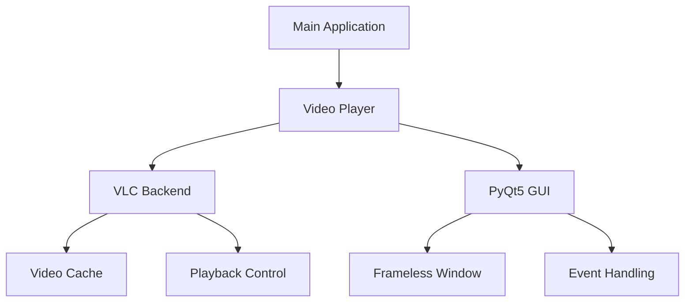

# 🎬 TikTok Local Viewer

<div align="center">


[](https://opensource.org/licenses/MIT)
[](https://www.python.org/)
[](https://www.videolan.org/vlc/)
[](https://pypi.org/project/PyQt5/)

A sleek, TikTok-style video viewer for your local video collection. Built with Python and VLC.

[Features](#features) • [Installation](#installation) • [Usage](#usage) • [Shortcuts](#shortcuts) • [Contributing](#contributing)

</div>

---

## ✨ Features

- 🖼️ **Frameless Design** - Clean, modern interface without window decorations
- 🎥 **Smooth Video Playback** - Powered by VLC media player
- 📱 **TikTok-Style Navigation** - Vertical scrolling between videos
- 🔄 **Smart Preloading** - Preloads adjacent videos for instant playback
- 📐 **Adaptive Sizing** - Automatically adjusts to video dimensions
- 💾 **Folder Memory** - Remembers your last video folder
- 🎯 **Always on Top** - Window stays visible for easy access
- 🎬 **Multiple Format Support** - Plays MP4, MOV, AVI, MKV, WMV

## 🚀 Installation

### Prerequisites

- Python 3.6 or higher
- VLC Media Player
- Git (optional)

### Quick Install

1. **Clone the repository** (or download ZIP):
   ```bash
   git clone https://github.com/BertramAakjaer/tiktok-local-viewer.git
   cd tiktok-local-viewer
   ```

2. **Install dependencies**:
   ```bash
   pip install -r requirements.txt
   ```

3. **Run the application**:
   ```bash
   python main.py
   ```

### Building Executable

To create a standalone executable:

1. **Run the build script**:
   ```bash
   build.bat
   ```
   
The executable will be created in the `dist` folder.

## 🎮 Usage

1. Launch the application
2. Select a folder containing videos
3. Navigate using mouse wheel or arrow keys
4. Click and drag to move the window
5. Press Space to pause/play

## ⌨️ Keyboard Shortcuts

| Key           | Action                    |
|---------------|---------------------------|
| ↑ / ↓        | Previous/Next video       |
| Space         | Play/Pause               |
| Enter         | Show in File Explorer    |
| Esc          | Exit application         |
| Mouse wheel   | Navigate videos          |

## 🎥 Supported Formats

- MP4 (*.mp4)
- MOV (*.mov)
- AVI (*.avi)
- MKV (*.mkv)
- WMV (*.wmv)

## 🛠️ Technical Details

### Architecture



### Dependencies

- `PyQt5`: GUI framework
- `python-vlc`: VLC media player bindings
- `pyinstaller`: Executable creation

## 🤝 Contributing

Contributions are welcome! Please feel free to submit a Pull Request.

## 📝 License

This project is licensed under the MIT License - see the [LICENSE](LICENSE) file for details.

## 🙏 Acknowledgments

- VLC Media Player for the robust playback engine
- PyQt5 for the GUI framework
- TikTok for interface inspiration

---

<div align="center">

Made with ❤️ by [Bertram Aakjær](https://github.com/BertramAakjaer/)

</div>